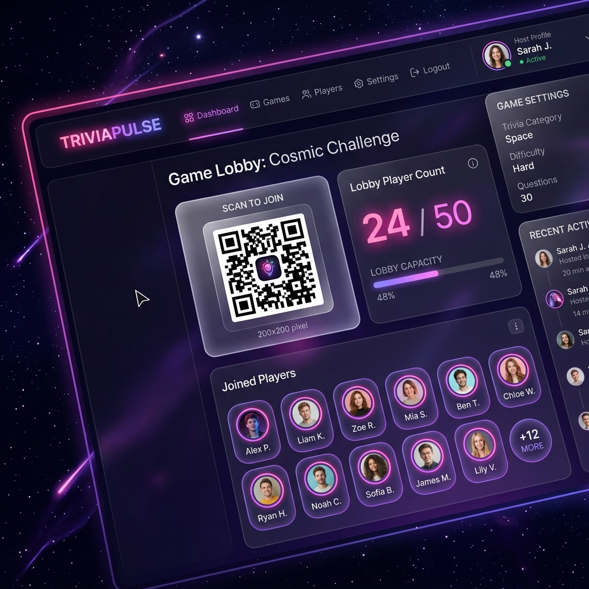

# ⚡ TriviaPulse

A highly polished, premium local-multiplayer trivia game built with a modern **Cosmic Glassmorphism** design system. Host TriviaPulse locally on your computer, project the main dashboard, and let friends join instantly as controllers on their mobile devices, tablets, or laptops over the same Wi-Fi network!



---

## 🚀 Key Features

- **Direct Single-Lobby Flow**: No game PIN friction! Players land directly on nickname selection and queue instantly.
- **Scan-to-Join QR Code**: A highly scaled-up `200x200` QR code is automatically generated on the lobby board for effortless, far-distance scanning.
- **Vibrant Cosmic Glass UI**: Retro-futuristic dark mode theme featuring glowing cards (`backdrop-filter`), elegant Outfit Google Fonts, pulsing timers, and oversized responsive tap targets.
- **Accuracy + Speed Scoring Engine**: Calculates points dynamically based on answer correctness and sub-second speed:
  $$\text{Points} = \text{Math.max}(500, \text{Math.round}(1000 \times (1 - \frac{\text{Time Taken}}{\text{Question Duration}} \times 0.5)))$$
  Plus, players rack up a **Streak Bonus** of $+50$ points per question in a correct streak (up to $+250$).
- **Color-Aligned True/False**: Both player screens and host boards are perfectly color-coordinated (True = Blue Diamond, False = Red Triangle).
- **Literal Results Charts**: Vertical results bar charts display literal answer option text underneath the shapes in real-time.
- **Podium Stan Saver**: Automatically exports a beautifully formatted `.txt` report of date, participants, top-3 podium champions, and full score standings into a `results/` folder on game completion.
- **Lobby Limits**: Restricts active lobbies to a maximum of 50 players.

---

## 🛠️ Tech Stack

- **Backend**: Node.js, Express, Socket.IO
- **Frontend**: Vanilla HTML5, CSS3 (Variables, Keyframe Animations, Flexbox/Grid), Vanilla ES6 JavaScript
- **QR Engine**: qrcodejs client library

---

## 🏃‍♂️ Quick Start

### 1. Install Dependencies
Navigate to your project root folder and install:
```bash
npm install
```

### 2. Choose Your Hosting Mode

#### 🌐 Mode A: Local Wi-Fi / LAN Multiplayer (Recommended)
Allows any device (phones, tablets) connected to the same Wi-Fi network to join and play.
```bash
node server.js --lan
```
- **Projector View**: Go to `http://localhost:3000/host.html` on your computer.
- **Player View**: Players go to the resolved LAN IP address displayed on the host screen (e.g. `http://192.168.10.59:3000`) or scan the large QR code.

#### 🌍 Mode B: Internet / Public WAN Multiplayer (via Pinggy SSH Tunnel)
Allows players anywhere in the world to join your locally hosted session from any cellular connection or external Wi-Fi network! No complex network setup or port-forwarding needed.
```bash
node server.js --tunnel
```
- **Projector View**: Go to `http://localhost:3000/host.html`.
- **Player View**: Once the tunnel establishes, the secure HTTPS URL (e.g. `https://xxxx.run.pinggy-free.link`) automatically resolves in the console. The host lobby card dynamically updates the join address and draws the large `200x200` scan-to-join QR code on-the-fly. Players just scan to play!

#### 💻 Mode C: Local-Only Development Mode
Strictly binds to `127.0.0.1` (localhost). Labeled as a developmental mode and put last. Perfect for private testing on a single computer using local tabs.
```bash
node server.js
```
- **Projector View**: Go to `http://localhost:3000/host.html`.
- **Player View**: Go to `http://localhost:3000/` in an incognito tab.

---

## ✍️ How to Add Custom Quizzes

Adding your own trivia sheets is incredibly simple:
1. Create a `.csv` file inside the `quizzes/` directory (e.g. `quizzes/my_awesome_quiz.csv`).
2. Follow this standard header template:
   ```csv
   Type,Question,TimeLimit,OptionA,OptionB,OptionC,OptionD,CorrectAnswer
   ```
3. Save the file. When you refresh the host setup page, your new quiz will automatically populate in the selection dropdown!

### Supported Question Formats:
- **Multiple Choice**: Set `Type` to `multiple-choice`, supply 4 options, and provide the correct option text in `CorrectAnswer`.
- **True/False**: Set `Type` to `true-false`, set `OptionA` to `"True"`, `OptionB` to `"False"`, leave C and D blank, and write `"True"` or `"False"` in `CorrectAnswer`.
- **Short Answer / Fill-in-the-Blank**: Set `Type` to `short-answer`, leave options A through D blank, and write the exact text (or numerical value) to match case-insensitively in `CorrectAnswer`.

---

## 📦 Default Quizzes Included

1. **`quizzes/general_knowledge.csv`**: A general knowledge starter set.
2. **`quizzes/bible_knowledge.csv`**: A comprehensive Bible trivia set featuring strictly numerical fill-in-the-blank answers for seamless mobile keyboard input.

---

## 🏆 Standings Export Example (`results/`)

When a session concludes, a report is automatically logged inside the `results/` folder:
```txt
====================================================
 TRIVIAPULSE GAME RESULTS
====================================================
Date/Time  : 5/25/2026, 5:40:00 PM
Quiz Name  : BIBLE KNOWLEDGE
Total Players: 4

🏆 FINAL CHAMPIONS (PODIUM) 🏆
----------------------------------------------------
1st Place 🥇: Sarah - 6450 pts (Streak: 5)
2nd Place 🥈: Emma - 5820 pts (Streak: 4)
3rd Place 🥉: David - 4100 pts (Streak: 2)

FULL STANDINGS
----------------------------------------------------
1. Sarah - 6450 pts (Streak: 5)
2. Emma - 5820 pts (Streak: 4)
3. David - 4100 pts (Streak: 2)
4. John - 2500 pts (Streak: 1)
====================================================
```
